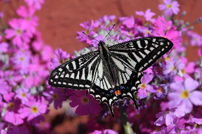
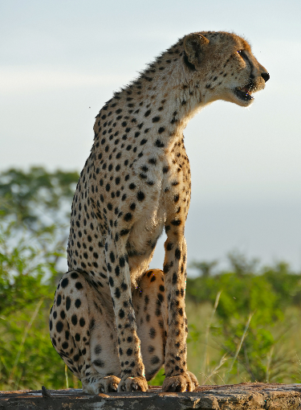
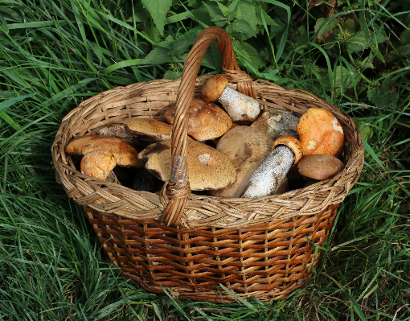

# SRGAN

##### Training on DIV2k
 - Train SRResNET
 ```
python train_srresnet.py \
--iterations 1000000 \
--step_per_epoch 100000 \
--batch_size 16 \
--crop_size 96 \
--downscale_factor 4 \
--image_dir DIV2K_train_HR \
--model_dir model_files \
 ```
  - And then train SRGAN using
  ```
  python train_srgan.py \
--iterations 200000 \
--step_per_epoch 100000 \
--batch_size 16 \
--crop_size 96 \
--downscale_factor 4 \
--image_dir DIV2K_train_HR \
--model_dir model_files \
--generator_weights_path ../model_files/srresnet/srresnet_weights_epoch_50
  ```
  
  
  ##### Results
  ###### Lower resolution images
    
  
  ###### Generated high resolution images
  
  
  
